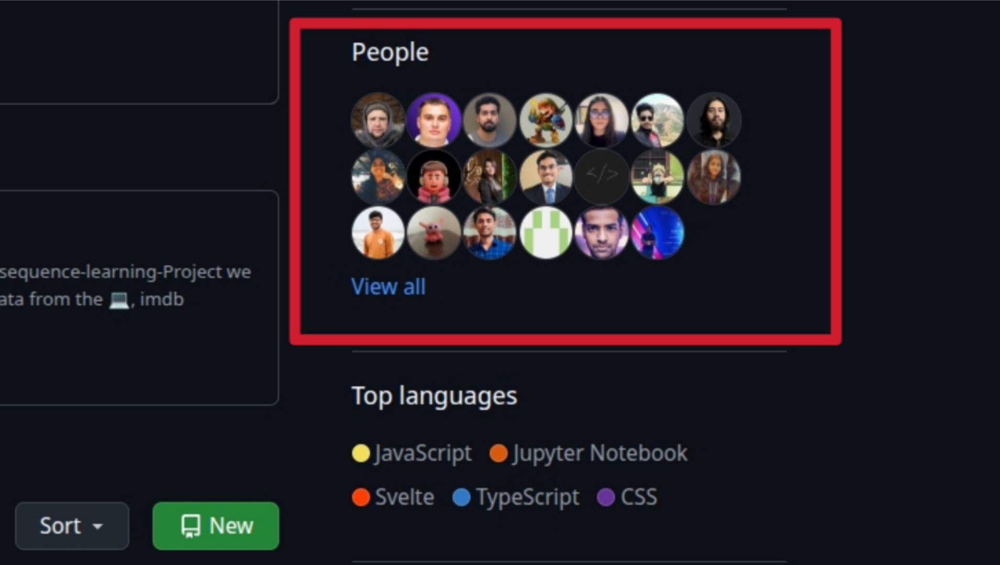
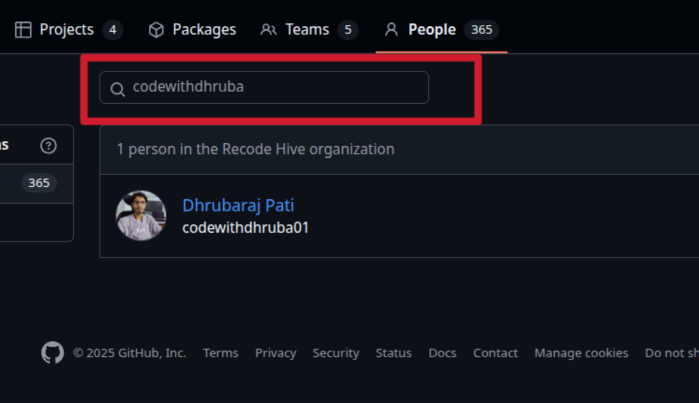
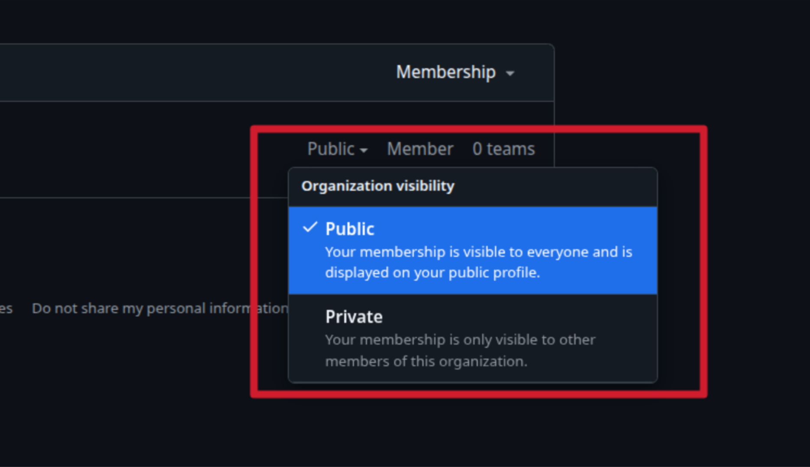

# Recode Hive Community Support

**Welcome to our Recode Hive community support page.**

If you have any questions, you can refer to the community moderators or support.

---

## 🟢  Community FAQ

This is a list of all frequently asked questions about this **Recode Hive community.**

## 🟢 How do I join Community?

You can join this organization by <a href="https://github.com/recodehive/Support/issues/new?assignees=&labels=invite+me+to+the+community&projects=&template=invitation.yml&title=Please+invite+me+to+the+Recode-Hive+GitHub+Community+Organization">**Raising an issue on this repository**</a> or add your Profile <a href="https://recodehive.github.io/awesome-github-profiles/">**Page**</a>

---

## 🟢  How to make the organization public?

Are you already a member of this community?  
**Follow these steps to make this organization public on your GitHub profile**:

1. Go to Your GitHub Organization <a href="https://github.com/recodehive">**Recode Hive**</a>

2. Navigate to the community homepage and click the and click the <a href="https://github.com/orgs/recodehive/people">**People**</a> link.

3. In the search box, enter your **Name or GitHub username.**

4. On the far right, click the **Private** dropdown and select **Public**.

Your organization profile should now be public and accessible to everyone at:
🔗 
<a href="https://github.com/recodehive">**link**</a>

---

📌 **Did we leave out any important FAQ?**  
Feel free to  <a href="https://github.com/orgs/recodehive/people">**raise an issue**</a> This repo aims to automate the process of adding people to this org